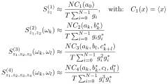
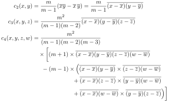

# Scientific background

[Documentation index](README.md) · [HDF5 input](hdf5.md)

This overview is based on
[Sifft et al., *Digital Signal Processing* 173 (2026), 105893](https://doi.org/10.1016/j.dsp.2026.105893).
The paper provides derivations, examples, and a more detailed treatment of estimating polyspectra
from real, finite data. We highly recommend reading it.

## Definition

SignalSnap uses the definition of higher-order spectra $S_z^{(n)}$ introduced by
[Brillinger](https://doi.org/10.1214/aoms/1177699896):

$$
2\pi\delta(\omega_1 + \cdots + \omega_n)S_z^{(n)}(\omega_1, \ldots, \omega_{n-1})
= C_n\bigl(z(\omega_1), \ldots, z(\omega_n)\bigr),
$$

where $C_n$ is a higher-order multivariate cumulant. For multiple, real, stationary signals
$z_1$, ..., $z_n$, this generalizes to cross-polyspectra:

$$
2\pi\delta(\omega_1 + \cdots + \omega_n)S_{z_1,\ldots,z_n}^{(n)}(\omega_1, \ldots, \omega_{n-1})
= C_n\bigl(z_1(\omega_1), \ldots, z_n(\omega_n)\bigr).
$$

SignalSnap estimates these spectra from finite, real measurement traces as described below.

## Why use higher-order spectra?

- Cumulants above second order vanish for Gaussian processes. Because cumulants add for independent
  processes, additive independent Gaussian noise does not contribute at orders three and above.
- Third-order spectra reveal phase correlations between two frequencies and their sum.
- Fourth-order spectra can describe correlations between spectral intensities.
- Cross-polyspectra extend these measurements to correlations among multiple channels.

## Estimation from finite traces

Assume a signal $z(t)$ is known at $N$ equidistant points in a timespan $T$. We define:

$$
z_i = z(iT/N), \quad \text{with} \quad 0 \leq i \le N-1.
$$

Using a window function $g_i$ to improve the spectral resolution, we can write the discrete Fourier
transform as:

$$
a_k = \frac{T}{N} \sum_{i=0}^{N-1} g_i z_i e^{2\pi \mathrm{j} i k/N}, \quad \text{with} \quad 0 \leq k \le N-1.
$$

SignalSnap uses the approximate confined Gaussian window
derived by [Starosielec and Hägele](https://doi.org/10.1016/j.sigpro.2014.03.033) as its window
function.

SignalSnap takes the input channels provided by the user and splits each channel into windows of
`window_points` samples, denoted here by $N$. For each channel and window, the Fourier coefficients
are computed and used to estimate polyspectra based on the following formulas (here, $z_i$ no longer
denotes the different samples of one channel, but different channels):

  

where $S_{z_1,z_2,z_3,z_4}^{(4)}(\omega_k, \omega_l)$ is a two-dimensional slice of the full
trispectrum:

$$
S_{z_1,z_2,z_3,z_4}^{(4)}(\omega_k, \omega_l, \omega_p) \approx \frac{N C_4(a_k, b_l, c_p, d_{k+l+p}^\ast)}{T \sum_{i=0}^{N-1}g_i^3 g_i^\ast}.
$$

$a_k$ denotes the Fourier coefficients of the first channel, $b_k$ the coefficients of the second
channel, and so on. The cumulants $C_1(\ldots), \ldots, C_4(\ldots)$ must be estimated from finite
data. SignalSnap implements unbiased, finite-sample, multivariate cumulant estimators derived by
[Schefczik and Hägele](https://arxiv.org/abs/1904.12154):

  

They take the Fourier-coefficient vectors from `m` different windows and treat them as samples for
a multivariate k-statistic. Each slice of `m` windows produces one spectral estimate provided by
the formulas above. The final spectrum is their average, and their variation provides the standard
error.

## Statistical assumptions

“Unbiased” describes the cumulant estimator when its `m` Fourier-coefficient vectors are independent
and identically distributed. In practice, a polyspectral interpretation requires:

- real input channels;
- equal sampling intervals and equal trace lengths;
- stationarity;
- a window duration long enough to resolve narrow spectral features; and
- successive windows that are approximately independent.

Violating these assumptions can introduce correlations or bias that the k-statistic prefactors do
not remove.

Non-stationary data can still produce an output, often called a *quasi-polyspectrum*, but it is not
a Brillinger polyspectrum and may depend strongly on `m`. SignalSnap 2.0 does not perform a
stationarity test; that check remains the user's responsibility.

## Current scope

The PyTorch implementation covers the real-signal estimators through the bispectrum and the
two-dimensional diagonal trispectrum slice. It supports arbitrary channel tuples, window
normalization, interlacing, and standard errors.

It does not currently provide:

- the full three-dimensional trispectrum or additional parallel planes;
- complex-valued input channels;
- dedicated quasi-polyspectrum diagnostics;
- stationarity tests; or
- automatic use of polyspectral symmetries to remove equivalent channel requests.

The original ArrayFire version offers some functionality outside this scope. See the
[migration guide](migration.md).
